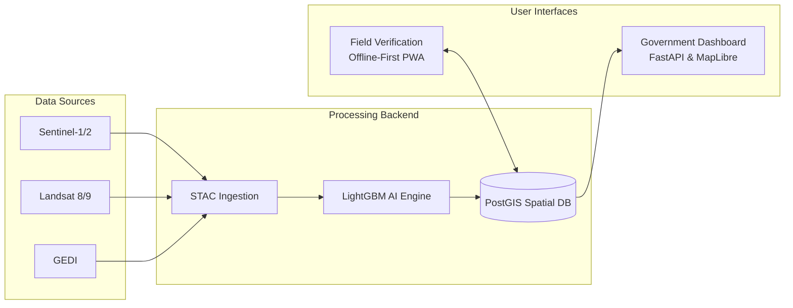

# SOLUTION PROPOSAL: Ashtalakshmi MRV Platform
## NESFIC-D-15: Forest & Plantation Monitoring and Carbon Assessment

---

### 1. Executive Summary
**Solution Name:** Ashtalakshmi MRV Platform

The Ashtalakshmi MRV (Measurement, Reporting, and Verification) Platform is a comprehensive, end-to-end digital infrastructure designed to modernize forest and plantation monitoring in Assam. By unifying high-resolution satellite imagery (Sentinel, Landsat), advanced machine learning methodologies, and offline-first mobile field applications, the platform establishes a continuous, transparent, and auditable pipeline for tracking forest health and carbon stock. 

**Key Value Proposition:** Our solution empowers the Assam Forest Department to perform monitoring up to **5x faster** and at **10x lower cost** compared to traditional manual audits, delivering precise, actionable data on demand. 

**Target Application:** Forest divisions and plantation programmes across Assam, specifically addressing the NESFIC-D-15 challenge to improve monitoring frequency and build a robust evidence base for biomass and carbon assessment.

**Grant Request Context:** We are requesting a total grant of **Rs 40 lakh** to fund the pilot deployment, localization, field calibration, and capacity building required to operationalize this platform in select divisions of Assam over a 12-month period.

---

### 2. Problem Analysis
Assam's rich biodiversity and extensive forest cover are critical assets in regional and global climate strategies. However, current monitoring frameworks face several structural challenges:
*   **Limited Frequency:** Field-based monitoring is labor-intensive and occurs infrequently, making it difficult to respond swiftly to rapid degradation, illegal logging, or pest outbreaks.
*   **Lack of Consistent Time-Series Data:** Historical data is often fragmented or siloed, preventing reliable tracking of growth and long-term carbon accumulation.
*   **Disconnected Workflows:** There is currently no integrated workflow that connects remote sensing analysis with ground-truth biomass and carbon assessment.
*   **High Costs and Manual Processes:** Manual field surveys are notoriously slow, expensive, and difficult to repeat consistently across vast and difficult terrains.

The NESFIC-D-15 challenge calls for spatial monitoring layers, better visibility of plantation growth, and a stronger evidence base for biomass assessment. Addressing these requires a shift from disjointed analog surveys to a continuous, data-driven, and scalable MRV paradigm.

---

### 3. Proposed Solution
The **Ashtalakshmi MRV Platform** directly addresses the NESFIC-D-15 requirements by delivering a scalable, unified software ecosystem comprised of four core modules:

1.  **Satellite Data Engine:** An automated pipeline for ingesting multi-modal satellite data (Sentinel-2, Landsat, GEDI) to provide consistent, up-to-date spatial layers of Assam's forest cover.
2.  **AI/ML Analysis Engine:** A robust analytical backend that processes spectral indices (NDVI, EVI) and leverages machine learning for biomass estimation and automated change detection.
3.  **Government Dashboard:** A secure, web-based interface built on MapLibre, offering real-time statistical readouts, split-screen temporal comparisons, and intuitive visualization of forest health metrics.
4.  **Field Verification Module:** An offline-first Progressive Web App (PWA) allowing field rangers to collect ground-truthing data (DBH, height, species) in remote areas without internet access, syncing securely upon connection.

---

### 4. Technical Architecture
The platform is built on modern, scalable, and open-source foundations to ensure long-term viability and interoperability.

**Technology Stack:**
*   **Backend / API:** FastAPI (Python)
*   **Database:** PostgreSQL with PostGIS extension for spatial querying
*   **Machine Learning:** LightGBM, Scikit-learn
*   **Mapping Interface:** MapLibre GL JS
*   **Deployment:** Docker containerization (Cloud or On-Premise compatible)

**Data Approach & Standards:**
We prioritize open-source and open-data infrastructure, pulling from Copernicus CDSE and USGS Landsat. The platform's methodologies are designed in strict compliance with globally recognized carbon accounting standards, including **Verra VM0047**, **IPCC 2006/2019 Guidelines**, and **ISO 14064-2**.

---

### 5. Key Capabilities Delivered

| NESFIC-D-15 Requirement | How Our Solution Delivers |
| :--- | :--- |
| **Generate repeatable spatial monitoring layers** | Automated STAC-based satellite ingestion pipeline providing continuous optical and radar coverage. |
| **Track change/growth indicators over time** | CCDC (Continuous Change Detection and Classification) time-series tracking combined with NDVI/EVI trends. |
| **Combine remote sensing with field verification** | Offline-first PWA allows seamless ground-truth data capture, immediately syncing with the PostGIS database. |
| **Provide traceable outputs for departmental review** | SHA-256 cryptographic audit chains and automated, tamper-evident PDF report generation. |
| **More frequent monitoring over large areas** | Harnessing Sentinel-2's 5-day revisit cycle combined with automated preprocessing algorithms. |
| **Better visibility of plantation growth/condition** | Wall-to-wall biomass maps derived from high-frequency spectral indices. |
| **Identification of areas requiring attention** | Z-score statistical anomaly detection pushing automated alerts for unexpected forest disturbances. |
| **Stronger evidence base for biomass/carbon** | Advanced integration of the Chave (2014) allometric equations and robust LightGBM predictive models. |

---

### 6. Carbon Assessment Methodology
To ensure high integrity and market readiness, the platform employs scientifically validated methodologies for carbon assessment:

*   **Allometric Model:** We implement the globally recognized **Chave et al. (2014)** pantropical allometric model.
*   **Accounting Framework:** **IPCC Tier 2 / Tier 3** guidelines.
*   **Above-Ground Biomass (AGB):** 
    `AGB = 0.0673 * (rho * D^2 * H)^0.976`
    *(Where rho = wood specific gravity, D = diameter at breast height, H = tree height)*
*   **Below-Ground Biomass (BGB):** Calculated utilizing standard root-to-shoot ratios specific to the ecological domain.
*   **Carbon Conversion:** Utilizes a standard carbon fraction of **0.47** (for tropical broadleaf).
*   **CO2 Equivalent (tCO2e):** Calculated as `Carbon * (44 / 12)`.
*   **Uncertainty Quantification:** Evaluated per IPCC guidelines, augmented by LightGBM quantile regression to provide scientifically defensible uncertainty bounds on wall-to-wall maps.

---

### 7. Indicative Technology Directions Alignment
The Ashtalakshmi MRV Platform heavily aligns with the cutting-edge technological directions encouraged by the Assam Forest Department:
*   **Optical/SAR Remote Sensing:** Deep integration of Sentinel-2 (optical) and Sentinel-1 (SAR) data fusion to overcome cloud cover limitations in the region.
*   **AI/ML Integration:** Utilization of LightGBM algorithms for sophisticated biomass modeling and Z-score anomaly mapping for disturbance alerts.
*   **UAV Surveys:** Built to be integration-ready. Compatible with outputs from high-resolution UAV missions via standards like ODK and QField.
*   **Time-Series Algorithms:** Harnessing proven continuous monitoring models like CCDC and COLD.
*   **Standardized Carbon Models:** Strictly adhering to Chave 2014 and IPCC frameworks for unassailable credibility.

---

### 8. Pilot Implementation Plan
We propose a phased, 12-month rollout to ensure rigorous testing, localization, and seamless adoption:

*   **Phase 1 (Months 1-3): Platform Deployment & Baselining**
    *   Deploy cloud infrastructure and baseline historical data for two selected pilot divisions (e.g., Kaziranga buffer zone and Manas National Park fringes).
*   **Phase 2 (Months 4-6): Calibration & Field Truthing**
    *   Deploy the mobile PWA to rangers. Collect initial field data to train and localize the LightGBM ML models specifically for Assam’s ecological parameters.
*   **Phase 3 (Months 7-9): Dashboard Rollout & Training**
    *   Official launch of the Government Dashboard. Conduct comprehensive capacity-building and training workshops for forest department staff.
*   **Phase 4 (Months 10-12): Operational Monitoring & Reporting**
    *   Initiate active anomaly alerts. Generate the first automated carbon assessment reports ready for departmental review and policy planning.

---

### 9. Scalability & Wider Application
The platform is inherently designed for massive scale and easy replication:
*   **Infrastructure Agnostic:** Fully containerized via Docker, allowing deployment on government state data centers, AWS, or Azure without vendor lock-in.
*   **State-Wide Extension:** Once calibrated in the pilot divisions, the system can rapidly scale to encompass all forest divisions and plantation drives across Assam with marginal additional software cost.
*   **Regional Expansion:** The system architecture is highly relevant to neighboring Northeastern states (Meghalaya, Nagaland, Mizoram) facing similar ecological and monitoring challenges.
*   **Market Readiness:** Ensures Assam's forestry data is formatted, verified, and traceable enough to seamlessly integrate into national or international Carbon Credit marketplaces.

---

### 10. Team & Organization
*(Team details and specific technical profiles to be attached in the final submission annexure)*

Our organization comprises seasoned remote sensing scientists, geospatial software engineers, and carbon accounting experts who have proven experience delivering enterprise-grade natural resource monitoring solutions.

---

### 11. Budget Estimate
To achieve these outcomes over the 12-month pilot phase, we request **Rs 40 lakh**, allocated as follows:

| Component | Cost (INR Lakh) | Description |
| :--- | :--- | :--- |
| **Development & Customization** | 12.0 | Software engineering, AI model tuning, UI/UX for dashboard/PWA |
| **Cloud Infrastructure (1 Year)** | 6.0 | Hosting, satellite data pipeline compute, PostGIS instances |
| **Field Equipment & Surveys** | 8.0 | Ground-truthing campaigns, surveyor costs, mobile devices |
| **Training & Capacity Building** | 6.0 | Ranger workshops, departmental training, manuals |
| **Documentation & Compliance** | 4.0 | Validation reports, standard alignment, QA/QC audits |
| **Contingency** | 4.0 | Unforeseen technical or logistical overruns |
| **Total Requested Budget** | **40.0** | |

---

### 12. Expected Outcomes & Impact
By adopting the Ashtalakshmi MRV Platform, the Assam Forest Department will realize transformative improvements in forest management capabilities:
*   **10x Increase in Monitoring Frequency:** Transitioning from biennial field surveys to near real-time satellite oversight.
*   **90% Reduction in Audit Costs:** Massive savings on manual measurement and verification logistics.
*   **Rapid Intervention:** Automated disturbance and anomaly alerts delivered within 5 days of occurrence.
*   **Economic Opportunity:** Establishment of a highly credible, traceable carbon credit pipeline to unlock new revenue streams for the state.
*   **Capacity Building:** Hands-on training and technological empowerment for 50+ forest rangers and departmental staff.
